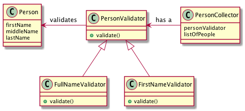

# Strategy Pattern exercise
## Person validator
Your task is to implement a person validator with a Strategy Command. You can extend the validator class to validate different aspects from the Person object

With a traditional OO focus you'll get something like the next diagram:

*Extra points*: If you implement this in Scala, Clojure or Java 8 avoiding the validator interface.